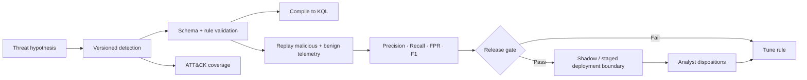

<div align="center">

# DetectionForge

### Production-minded detection engineering as code

**Author → compile → replay → measure → gate → improve**

[](https://github.com/VinayK88/DetectionForge/actions/workflows/ci.yml)
[](https://www.python.org/)
[](#what-detectionforge-does)
[](#attack-coverage)
[](#evaluation-boundary)

DetectionForge answers a simple question that is easy to skip in security engineering:

> **How do we know a detection change is actually safe to ship, rather than merely syntactically valid?**

</div>

---


DetectionForge treats security detections like production software. A rule has versioned logic, a stable ID, ATT&CK mapping, benign hard negatives, attack replay, measurable precision/recall/FPR, CI release gates, compiled KQL, and an analyst-feedback loop.

The goal is not to build another collection of queries. The goal is to demonstrate the **engineering lifecycle around a detection**.

## Baseline at a glance

| Detection | Precision | Recall | False-positive rate | F1 | Gate |
| --- | ---: | ---: | ---: | ---: | :---: |
| Encoded PowerShell + suspicious network utility | **83.3%** | **83.3%** | **4.0%** | **83.3%** | ✅ |
| High-risk identity velocity from new device | **80.0%** | **80.0%** | **5.0%** | **80.0%** | ✅ |
| Suspicious high-privilege OAuth consent | **83.3%** | **100.0%** | **5.0%** | **90.9%** | ✅ |

**Current release gate:** precision ≥ 80% · recall ≥ 80% · FPR ≤ 10%.

The checked-in fixture contains **81 deterministic replay events** spanning endpoint, identity, and OAuth scenarios, including malicious behavior and deliberately confusing benign lookalikes.

These are synthetic replay results, not production efficacy claims.

## What DetectionForge does



### Implemented today

- **Sigma-style YAML detections** with stable IDs, severity, ATT&CK tags, false-positive documentation, and log-source metadata.
- **Rule validation** for required fields, supported selectors, duplicate IDs, and condition grammar.
- **Transparent Sigma-subset → KQL compilation** so generated logic remains reviewable.
- **Deterministic attack + benign replay** across endpoint and Entra-style telemetry.
- **Regression metrics** for precision, recall, specificity, FPR, F1, TP/FP/FN/TN, and matched event IDs.
- **CI release gating** across Python 3.10, 3.11, and 3.12.
- **ATT&CK coverage reporting** for T1059.001, T1078, and T1098.003.
- **Analyst-feedback summaries** kept separate from synthetic ground truth.
- **FastAPI scorecard** with rule health, ATT&CK coverage, benign-lookalike context, analyst feedback, JSON endpoints, and OpenAPI docs.
- **Docker + CLI workflows** for local review and reproducibility.

## Detection stories

| Rule | Security surface | ATT&CK | Hard negative intentionally included |
| --- | --- | --- | --- |
| **Suspicious high-privilege OAuth consent** | Entra / OAuth | `T1098.003` | Approved internal app onboarding and authorized security testing |
| **Encoded PowerShell with suspicious network utility** | Endpoint | `T1059.001` | Legitimate administrative automation using encoded PowerShell |
| **High-risk identity velocity from new device** | Entra sign-in | `T1078` | Approved travel from a newly enrolled device |

The hard negatives matter: a rule cannot pass simply by alerting on everything suspicious-looking.

## Dashboard

Run the FastAPI app and the root page becomes an analyst/reviewer scorecard rather than a raw API landing page.

It surfaces:

- release-ready rule count
- mean precision and recall
- ATT&CK technique coverage
- per-rule precision / recall / FPR / F1
- pass/fail release state
- documented benign lookalikes
- compiled-KQL links
- analyst-review precision and benign reasons
- explicit synthetic-data boundary

```bash
uvicorn detectionforge.api:app --reload
```

Open `http://127.0.0.1:8000` for the dashboard or `http://127.0.0.1:8000/docs` for OpenAPI.

Health check:

```bash
curl http://127.0.0.1:8000/healthz
```

## Quick start

```bash
git clone https://github.com/VinayK88/DetectionForge.git
cd DetectionForge

python -m venv .venv
source .venv/bin/activate
pip install -e '.[api]'
```

Then exercise the lifecycle directly:

```bash
# Validate every detection
detectionforge validate

# Run the regression suite
detectionforge evaluate --output reports/local-evaluation.json

# Review ATT&CK coverage
detectionforge coverage

# Compile one detection to KQL
detectionforge compile-kql detections/suspicious_oauth_consent.yml
```

Run tests:

```bash
python -m unittest discover -s tests -v
```

## Example release decision

```text
Detection: Suspicious High-Privilege OAuth Consent
Rule ID:   df-entra-001

Precision             83.3%   PASS
Recall               100.0%   PASS
False-positive rate    5.0%   PASS
ATT&CK                 T1098.003

RELEASE GATE: PASS
```

A regression below the configured precision or recall threshold—or above the allowed false-positive rate—fails the gate instead of silently shipping a noisier rule.

## KQL compilation

Example source definition:

```yaml
detection:
  selection:
    ConsentType: AllPrincipals
    Permission|contains:
      - Mail.ReadWrite
      - Files.ReadWrite.All
    AppVerified: false
  condition: selection
```

The supported subset compiles into reviewable KQL and generated examples are stored under `reports/compiled-kql/`.

This project deliberately does **not** claim full Sigma compatibility. In a production implementation, broad parsing should be delegated to maintained upstream Sigma tooling while DetectionForge retains the replay, regression, quality-gate, and deployment-control layers.

## ATT&CK coverage

| Technique | Detection |
| --- | --- |
| `T1059.001` | `df-endpoint-001` |
| `T1078` | `df-entra-002` |
| `T1098.003` | `df-entra-001` |

Coverage is generated from rule metadata rather than maintained as a separate manual spreadsheet.

## Analyst feedback without label leakage

Offline labels and production analyst dispositions answer different questions, so DetectionForge keeps them separate.

The checked-in feedback fixture demonstrates:

```text
true_positive
benign
unknown
```

The feedback layer calculates reviewed volume, analyst precision, and recurring benign reasons. That creates a tuning signal without rewriting the benchmark ground truth after the fact.

## Repository structure

```text
DetectionForge/
├── detectionforge/
│   ├── rules.py          # rule loading, validation, matching
│   ├── compiler.py       # supported Sigma-subset → KQL
│   ├── replay.py         # attack / benign replay + metrics
│   ├── coverage.py       # ATT&CK coverage
│   ├── feedback.py       # analyst-disposition summaries
│   ├── report.py         # machine-readable evaluation report
│   ├── api.py            # dashboard + JSON/OpenAPI endpoints
│   └── cli.py            # command-line workflow
├── detections/           # version-controlled detections
├── data/                 # synthetic telemetry + feedback fixtures
├── reports/              # baseline evidence + compiled KQL
├── tests/                # regression + dashboard tests
├── docs/                 # architecture / operational boundary
├── scripts/              # baseline and export helpers
└── .github/workflows/    # detection quality gate
```

## Production evolution

The next useful steps are operational rather than “add more rules”:

1. Use maintained Sigma tooling for full parser/backend coverage while preserving DetectionForge's regression gates.
2. Add Microsoft Sentinel / Defender and Splunk deployment adapters with dry-run, shadow, approval, version, and rollback controls.
3. Replay bounded historical telemetry and estimate alerts/day against analyst capacity.
4. Add schema and data-quality checks so missing fields cannot masquerade as better precision.
5. Track detection drift, ownership, review SLA, stale rules, and telemetry dependencies.
6. Compare pre/post-change analyst precision at equal review volume.
7. Add OCSF/ECS field mappings and telemetry lineage for each rule.

## Evaluation boundary

All checked-in telemetry, identities, applications, commands, URLs, and labels are synthetic. DetectionForge does not execute malware, collect credentials, exploit systems, or autonomously deploy production controls.

Production use should require authorized telemetry, privacy review, schema validation, staged deployment, human approval, and rollback.

See [SECURITY.md](SECURITY.md) and [architecture notes](docs/architecture.md).

---

<div align="center">

**Detection engineering should be measurable before it becomes operational.**

</div>
