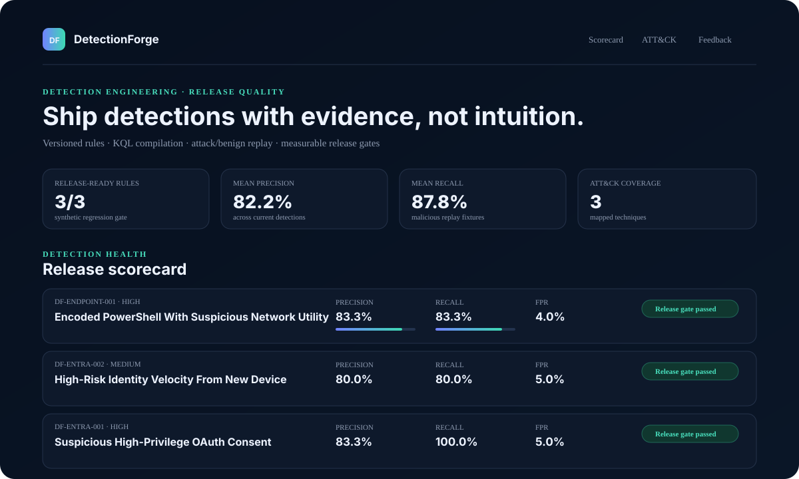
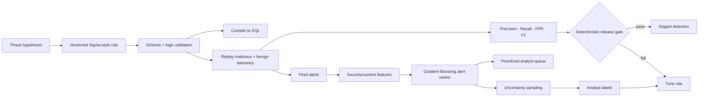

<div align="center">

# DetectionForge

### Detection Engineering as Code · Supervised Alert Prioritization · Active Learning

**Author → compile → replay → measure → gate → rank → learn → improve**

[](https://github.com/VinayK88/DetectionForge/actions/workflows/ci.yml)
[](https://www.python.org/)
[](#architecture)
[](#supervised-alert-prioritization)
[](#detection-evidence)
[](#evaluation-boundary)

> **Core question:** How do we know a detection change is safe to ship—and, once alerts fire, which ones deserve analyst attention first?

</div>

---



DetectionForge treats detections like production software. Rules remain explicit, versioned, replayable, and release-gated. A separate machine-learning layer ranks **already-fired alerts** and surfaces uncertain examples for analyst labeling.

The design deliberately separates two jobs:

- **Detection rules decide coverage and release readiness.**
- **ML decides review priority, not whether a security rule exists or ships.**

## Architecture



## Detection evidence

The checked-in synthetic replay contains **81 deterministic events** spanning endpoint, identity, and OAuth scenarios, including deliberately confusing benign lookalikes.

| Detection | Precision | Recall | False-positive rate | F1 | Gate |
| --- | ---: | ---: | ---: | ---: | :---: |
| Encoded PowerShell + suspicious network utility | 83.3% | 83.3% | 4.0% | 83.3% | ✅ |
| High-risk identity velocity from new device | 80.0% | 80.0% | 5.0% | 80.0% | ✅ |
| Suspicious high-privilege OAuth consent | 83.3% | 100.0% | 5.0% | 90.9% | ✅ |

Current deterministic gate: **precision ≥ 80% · recall ≥ 80% · FPR ≤ 10%**.

These values validate the synthetic replay path only; they are not production efficacy claims.

## Supervised alert prioritization

DetectionForge now trains a **`GradientBoostingClassifier`** on the synthetic replay labels and evaluates it on a stratified holdout before refitting the ranking model on the complete fixture.

The feature space intentionally excludes the ground-truth label and scenario name. It uses operational security context such as:

```text
rule match count
maximum rule severity
source / event type
identity risk level
new-device state
sensitive-access state
publisher verification
tenant-wide OAuth consent
sensitive OAuth scope count
encoded-command indicator
network-utility indicator
event field / text volume
```

For each alert, the ML layer returns:

- a priority score from the supervised model;
- the number of detection rules that fired;
- an uncertainty score;
- the event/scenario identifier for reproducible synthetic evaluation.

The ML score is **not used as a replacement detection** and is not presented as a calibrated probability of compromise.

## Active learning

`detectionforge ml-rank` also returns the alerts closest to the classifier decision boundary. Those cases are the most useful candidates for analyst review because additional labels can reduce uncertainty rather than repeatedly labeling obvious examples.

```text
fired alerts
    ↓
ML priority score
    ↓
uncertainty = closeness to 0.5
    ↓
high-uncertainty review queue
    ↓
analyst disposition
    ↓
future tuning / retraining input
```

The checked-in analyst-feedback layer remains separate from offline synthetic truth to avoid label leakage.

## Detection stories

| Rule | Security surface | ATT&CK | Hard negative |
| --- | --- | --- | --- |
| Suspicious high-privilege OAuth consent | Entra / OAuth | `T1098.003` | approved internal onboarding / authorized testing |
| Encoded PowerShell + suspicious network utility | Endpoint | `T1059.001` | legitimate encoded administrative automation |
| High-risk identity velocity from new device | Entra sign-in | `T1078` | approved travel from a newly enrolled device |

## CLI

```bash
python -m venv .venv
source .venv/bin/activate
pip install -e '.[api]'

# Validate rules
detectionforge validate

# Replay and enforce deterministic release gates
detectionforge evaluate --output reports/local-evaluation.json

# Train/evaluate the ML ranker and prioritize fired alerts
detectionforge ml-rank --output reports/local-ml-ranking.json

# ATT&CK coverage
detectionforge coverage

# Compile a rule to KQL
detectionforge compile-kql detections/suspicious_oauth_consent.yml

python -m unittest discover -s tests -v
```

## API / reviewer scorecard

```bash
uvicorn detectionforge.api:app --reload
```

The existing FastAPI scorecard surfaces rule health, ATT&CK coverage, replay metrics, benign-lookalike context, compiled KQL and analyst feedback. The ML ranking is intentionally available through the executable CLI/report path so reviewers can inspect the model evidence independently of rule release state.

## CI quality gate

GitHub Actions validates Python **3.10, 3.11 and 3.12** and runs:

```text
unit tests
rule validation
synthetic replay evaluation
supervised ML alert ranking
KQL export
module compilation
```

A code change is therefore checked across both deterministic detection engineering and the ML prioritization path.

## Repository structure

```text
DetectionForge/
├── detectionforge/
│   ├── rules.py          # rule loading + matching
│   ├── compiler.py       # supported Sigma subset → KQL
│   ├── replay.py         # malicious/benign replay + metrics
│   ├── ml.py             # Gradient Boosting ranker + active learning
│   ├── feedback.py       # analyst-disposition summaries
│   ├── coverage.py       # ATT&CK coverage
│   ├── report.py         # deterministic report
│   ├── api.py            # FastAPI scorecard
│   └── cli.py            # validate/evaluate/ml-rank workflows
├── detections/
├── data/                 # synthetic telemetry + feedback
├── reports/
├── tests/
└── .github/workflows/ci.yml
```

## Production evolution

A production implementation would use authorized historical telemetry, time-aware train/test splits, schema/data-quality validation, calibrated alert-volume targets, analyst dispositions with governance, feature drift monitoring, retraining controls, shadow deployment, rollback, and explicit review-capacity objectives.

## Evaluation boundary

All checked-in telemetry, identities, applications, commands, URLs and labels are **synthetic**. DetectionForge does not execute malware, collect credentials, exploit systems, or autonomously deploy detections.

The supervised holdout validates implementation and evaluation mechanics on the fixture; it does **not** establish production precision, recall, calibration, or incident-detection performance.

---

<div align="center">

**Rules provide coverage. ML prioritizes attention. Evidence decides what ships.**

</div>
