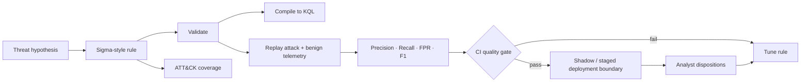

<div align="center">

# DetectionForge

### Detection engineering as code: author → compile → replay → measure → gate → improve

[](https://www.python.org/)
[](https://github.com/VinayK88/DetectionForge/actions/workflows/ci.yml)
[](#why-this-project)
[](#safety-boundary)
[](LICENSE)

**Sigma-style rules · KQL compilation · attack/benign replay · regression gates · ATT&CK coverage · analyst feedback**

</div>

---

DetectionForge is a defensive detection-engineering platform built around one operational question:

> **How do we know a detection change is actually safer to ship—not merely syntactically valid?**

A detection is treated like production code. It has a stable ID, version-controlled logic, tests, representative benign negatives, attack replay, measurable precision/recall/FPR, ATT&CK coverage, CI quality gates, and an analyst-feedback path.

## Why this project

Many security portfolios show individual queries or anomaly models. DetectionForge demonstrates the **lifecycle around detections**:



## What is implemented

- Sigma-style YAML detection definitions with stable IDs and ATT&CK tags.
- Validation for required metadata, supported selectors, duplicate IDs, and condition grammar.
- A transparent **Sigma-subset → Microsoft KQL compiler**.
- Deterministic synthetic telemetry across Entra identity/OAuth and endpoint process events.
- Attack and benign-hard-negative replay against the exact same rule logic.
- Per-rule precision, recall, specificity, false-positive rate, and F1.
- Merge gate defaults: **precision ≥ 0.80, recall ≥ 0.80, FPR ≤ 0.10**.
- ATT&CK technique coverage aggregation.
- Analyst disposition summary separated from synthetic ground truth.
- FastAPI/browser scorecard.
- Docker and GitHub Actions across Python 3.10–3.12.

## Included detection stories

| Rule | Surface | ATT&CK | Primary false-positive challenge |
| --- | --- | --- | --- |
| Suspicious high-privilege OAuth consent | Entra / OAuth | T1098.003 | Authorized security testing / onboarding |
| Encoded PowerShell + network utility | Endpoint | T1059.001 | Administrative automation |
| High-risk identity velocity from new device | Entra sign-in | T1078 | Approved travel / device enrollment |

The fixture includes both malicious cases and deliberate benign lookalikes so the release gate cannot pass by simply alerting on everything.

## Quick start

```bash
git clone https://github.com/VinayK88/DetectionForge.git
cd DetectionForge

python -m venv .venv
source .venv/bin/activate
pip install -e '.[api]'
```

Validate every rule:

```bash
detectionforge validate
```

Compile one rule to KQL:

```bash
detectionforge compile-kql detections/suspicious_oauth_consent.yml
```

Run the detection regression suite:

```bash
detectionforge evaluate --output reports/local-evaluation.json
```

View ATT&CK coverage:

```bash
detectionforge coverage
```

Start the browser/API demo:

```bash
uvicorn detectionforge.api:app --reload
```

Then open `http://127.0.0.1:8000` or `/docs`.

## Example PR quality gate

```text
Detection: Suspicious High-Privilege OAuth Consent
Rule ID:   df-entra-001

Precision             83.3%   PASS
Recall               100.0%   PASS
False-positive rate    5.0%   PASS
ATT&CK                 T1098.003

RELEASE GATE: PASS
```

The checked-in baseline is generated from `data/telemetry.jsonl` and is regression-tested in CI.

| Rule ID | Precision | Recall | FPR | F1 | Gate |
| --- | ---: | ---: | ---: | ---: | --- |
| `df-endpoint-001` | 83.3% | 83.3% | 4.0% | 83.3% | PASS |
| `df-entra-002` | 80.0% | 80.0% | 5.0% | 80.0% | PASS |
| `df-entra-001` | 83.3% | 100.0% | 5.0% | 90.9% | PASS |

These are synthetic replay measurements, not production detection-effectiveness claims.

## KQL compilation

Example rule fragment:

```yaml
detection:
  selection:
    ConsentType: AllPrincipals
    Permission|contains:
      - Mail.ReadWrite
      - Files.ReadWrite.All
    AppVerified: false
  condition: selection
```

DetectionForge compiles the supported subset into a reviewable KQL predicate and writes compiled queries under `reports/compiled-kql/`.

This is intentionally **not** a claim of full Sigma compatibility. The project focuses on detection lifecycle methodology. A production backend should use maintained upstream Sigma tooling for broad syntax support while keeping these replay and regression gates around the generated query.

## Analyst feedback loop

Synthetic benchmark quality and production analyst feedback are different evidence sources. DetectionForge keeps them separate.

`data/analyst_feedback.json` demonstrates dispositions such as:

```text
true_positive
benign
unknown
```

The feedback summarizer reports analyst precision and the most common benign reasons, which can drive rule tuning without silently rewriting the offline benchmark.

## Repository map

```text
detectionforge/
  rules.py          rule loading, validation, matching
  compiler.py       supported Sigma-subset → KQL
  replay.py         deterministic attack/benign replay
  coverage.py       ATT&CK coverage
  feedback.py       analyst disposition summaries
  report.py         machine-readable evaluation report
  api.py            FastAPI + browser scorecard
  cli.py            command-line workflow

detections/         version-controlled detection rules
data/               synthetic telemetry + analyst feedback fixtures
scripts/            baseline and KQL export helpers
tests/              rule/compiler/replay/feedback regression tests
reports/            reproducible generated evidence
docs/               architecture and operational boundary
.github/workflows/  CI release gate
```

## Production evolution

The next production-oriented extensions are intentionally different from simply adding more rules:

1. Delegate full Sigma parsing/compilation to maintained Sigma tooling while retaining DetectionForge regression tests.
2. Add Microsoft Sentinel / Defender and Splunk deployment adapters with **dry-run, shadow, approval, version and rollback controls**.
3. Replay time-bounded historical telemetry and estimate alerts/day at analyst-capacity thresholds.
4. Add schema/data-quality gates so missing fields cannot silently look like improved false-positive performance.
5. Add detection drift monitoring, rule ownership, review SLAs and stale-rule detection.
6. Link rule changes to analyst dispositions and measure before/after precision at equal review volume.
7. Add OCSF/ECS field mappings and a telemetry dependency graph for every detection.

## Safety boundary

All checked-in events, identities, applications, commands, URLs and labels are synthetic. DetectionForge does not exploit systems, execute malware, collect credentials, or autonomously deploy production security controls.

Production use should require authorized telemetry, privacy review, target-schema validation, staged deployment, analyst approval and rollback.

See [SECURITY.md](SECURITY.md) and [architecture notes](docs/architecture.md).

## License

MIT.
